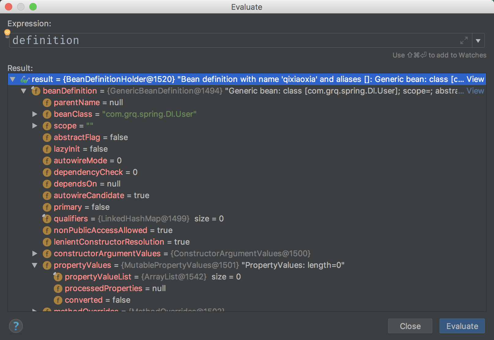
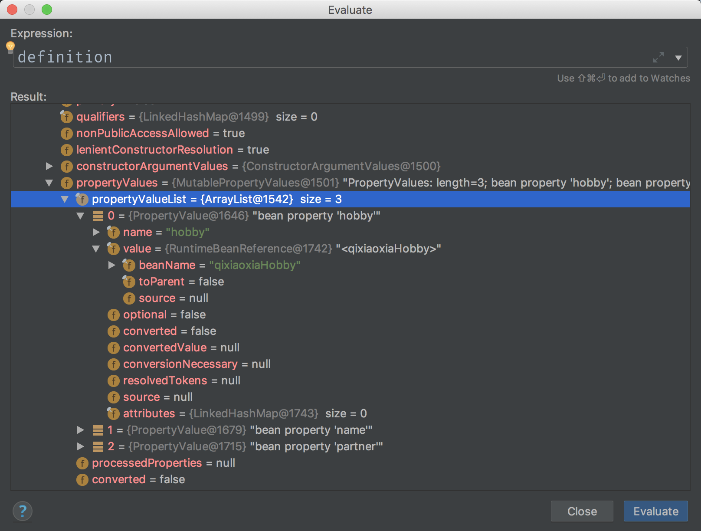

# “王大锤の非诚勿扰” —— Spring IoC / DI 思想详述

本文参考地址：

[《spring Ioc/DI的理解》](http://www.cnblogs.com/raysource/p/9300063.html)  
[《关于Spring IOC (DI-依赖注入)你需要知道的一切》](https://blog.csdn.net/javazejian/article/details/54561302)  
[《一、IOC和DI的概念》](https://www.cnblogs.com/gudulijia/p/6402213.html)  
[《深入理解IoC/DI》](https://www.cnblogs.com/xinhuaxuan/p/6132372.html)  
[《spring IOC篇二：xml的核心逻辑处理》](https://www.cnblogs.com/histlyb/p/8976635.html)

**温馨提示：**前方内容会引起认真怪和女权者些许不适，请出门左手边右拐。

----

# 一. 王大锤的相亲市场

> 我叫王大锤，是个码农，我们这个行业号称“人傻钱多速来”，不信？呵呵呵呵呵呵呵……  
> 
> 我的职业是码农，工作内容是 new 一个对象，日常聊天是如何找一个对象，睡觉是做梦如何 new 一个白富美对象陪我走上人生巅峰。总之，我没有对象。
> 
> 公司的同事连顺看我工作繁忙无暇撩妹，同时又日渐饥渴难耐，最后还是建议我去**婚介公司**碰碰运气，也许有个好运气，或者找个盘接一下，再不济也能遇见一群饥渴男一起回家组队打 Dota。于是我走到了**春天婚介公司**，踏上了登上人生巅峰之路。


大锤进入了**春天婚介公司**之后，主要办了三件事：

1. 进入**春天婚介公司**；
2. 按照婚介公司要求，填写**个人用户简历**；
3. 婚介公司告诉大锤，等待我们下一次的**联谊事宜**：到时候会用很多**本公司用户**参加，每个用户都有自己的个人条件，届时可进行配对或组队；

大锤想了想还有点小激动，然后就回了公司，打开了自己的 Markdown，开始写起了一篇**控制反转 (IoC)** 和**依赖注入 (DI)** 相关的教程。

 

# 二. Spring IoC / DI 的简单理解

在 [《spring Ioc/DI的理解》](http://www.cnblogs.com/raysource/p/9300063.html) 一文中，作者用**人力资源局**的例子方便读者的理解。所以笔者按照自己对 IoC / DI 的理解，也编了一个王大锤婚介公司之旅的故事，用段子的方式写出来，以期加深对自己和读者的印象。

## 2.1 IoC 与 DI 的定义

首先，笔者需要明确说明 IoC 与 DI 的定义。

> **控制反转 (Inversion of Control，即 IoC)** 是一种设计思想。在 Java 开发中，IoC 意味着**将你设计好的对象交给容器控制**，而不是传统的在你的对象内部直接控制。同时 IoC 也是面向对象编程中的一种设计原则，可以用来减低计算机代码之间的耦合度。  
> 对于 IoC，它最常用的一种手段叫做**依赖注入 (Dependency Injection，即 DI)**。DI 通过控制反转，对象在被创建的时候，由一个调控系统内所有对象的外界实体，将其所依赖的对象的引用传递给它。

上述定义也许比较难懂，所以笔者讲了开头的故事。故事中的春天婚介公司，就是我们经常使用的经典的 **Spring IoC 容器**。  
将上面段子的名词与 Spring 内容一一对应，则如下所示：

- 婚介公司 —— Spring IoC 容器
- 用户征婚简历 —— Spring beans
- 一次联谊活动 —— xml 配置文件
- 月老 —— 开发者（我）

## 2.2 IoC 的三个经典问题

对于 IoC 有三个经典问题：**谁控制谁？控制了什么？怎么实现了反转？**很多博客里都进行了一个回答，笔者也按照自己的故事模式进行一个回答。

1. **“谁控制谁？”**：**IoC / DI 容器**控制应用程序
	- 其实可以把 IoC 当做一个存储对象的容器，我们在开发中形成的对象都可以交给 Spring IoC 容器做一个统一的规范管理；
	- 我们在开发中形成的对象可以用一个 Spring bean 来表示，所以可以联想一下，Spring IoC 容器就是婚介公司，每个对象都向这个婚介公司投递了征婚简历，所有用户简历全部由婚介公司调配。所以 IoC 容器就充当了一个婚姻介绍的角色；
2. **控制了什么？**：IoC / DI 容器控制**对象本身的创建、实例化**，以及**控制对象之间的依赖关系**；
	- 开发之中的对象已经全部交由 IoC 容器来管理了，那我们在获取对象的时候，就得由 IoC 容器来给我们提供；
	- 例：我们想要和一个妹子配对：
		- 平常情况下，需要主动自己上去撩妹自己要（在实际工程中，即调用目标对象的 get API ）；
		- 现在既然我和妹子都是婚介公司的用户（都注册了 bean），婚介公司控制了我们对于对象的获取，那么就得通过婚介公司来把妹子给你（在实际工程中，即调用 Spring 的 getBean 方法，中间的 BeanDefinition 等细节内容暂且不表）；
3. **怎么实现了反转？**：主要体现在**控制权的反转**。因为现在应用程序不能主动去获取外部资源了，而是**被动等待 IoC / DI 容器给它注入它所需要的资源**，所以称之为反转。
	- 例：依旧用上面的例子：我们想要和一个妹子配对：
		- 平常情况下，我们直接去找妹子要过来，这种事情是我们自己去做的，**控制权在我们手里**（实际工程中，就是在 classA 中需要一个 classB 的实例，所以就在 classA 中直接 new 了一个 classB 的实例来使用）；
		- 现在既然我和妹子都是婚介公司的用户，那么向**婚介公司要求介绍**这个妹子，让**婚介公司把妹子交给我们**（实际工程中，就是通知 Spring IoC 容器“我需要 classB 的实例，你需要给我弄一个，然后把这个实例传给 classA”）；
	- 这样一对比，就发现创建权与控制权都**从开发者身上转移到了 Spring IoC 容器上**，即实现了控制的反转；

## 2.3 DI 的三个经典问题

同样，DI 也存在三个经典问题：**谁依赖谁？谁注入了谁？注入了什么？**

1. **“谁依赖谁？”**：**应用程序**依赖于 **IoC 容器**；
	- 上面也提到了我们找婚介公司介绍妹子配对的流程，可以看出我们用户是依赖于婚介公司的，也就是应用程序依赖于 IoC 容器；
2. **“谁注入了谁？”**：IoC 容器把**对象**注入于**应用程序**；
	- 依旧是我们找婚介公司介绍妹子配对的流程，婚介公司把同为用户的妹子给了我们，就相当于 IoC 容器将对象注入到了应用程序之中；
	- 这种我们需要了对象，IoC 将对象给我们的过程，就是依赖注入。
3. **“注入了什么？”**：注入**应用程序需要的外部资源**，比如有依赖关系的对象；
	- 婚介公司把同为用户的妹子给了我们，就相当于 IoC 容器将对象注入到了应用程序之中；

此时，笔者可以通过一个类比，来把依赖注入的关系进行说明：  

1. 一个 **xml 配置文件**中，定义了若干 **Spring beans**；
	- 即在一次联谊活动中，会有很多用户参加；
2. 对于这些 Spring beans，就是定义 bean 时各种各样的**属性**定义；
	- 对应于这些用户，就是说每一个用户都有自己的个人条件；
	- 所谓个人条件，就是身长八尺，容貌甚伟，有房有车，Q大H好，医卜星象门门会，钢琴摄影样样通之类的；
3. 根据开发者在 xml 配置文件中的定义，形成**依赖关系**。对于一个 bean 的依赖，可以依赖于一个 bean，也可以依赖于多个 bean；例如 bean 定义的 xml 配置文件中，会有类似于 p 命名空间的属性注入 (p:name="qixiaoxia")，或者是 ref 依赖关系注入 (pcbrand-ref=MacBookPro) 之类的配置关系，通过这些配置形成了依赖关系；
	- 对于这次联谊活动，月老牵线，一金童一玉女成功配对，喜结连理，从今以后过上没羞没臊的生活；当然也可能某个老司机勾搭上了多个用户，形成了一个只属于自己的小团伙，从此开启了它的 S8 征战之旅 (RNG IG 加油冲鸭！！！)；

> 注：在[《深入理解IoC/DI》](https://www.cnblogs.com/xinhuaxuan/p/6132372.html)中作者用一问一答的形式阐述了控制、依赖、注入等关系，以及与 IoC/DI 相关内容。本文有类似借鉴。

# 三. DI 的实现原理解析

控制反转 IoC 与依赖注入 DI 之间的关系，**控制反转是目的，依赖注入是实现控制反转的手段**。前面也提到，如果在传统模式中，A 类依赖于 B 类，就是在 A 类中 new 一个 B 类，或者是用 A 类的 set 方法将 B 类实例的引用注入 A 类。  
但是 IoC 将生成类的方式把传统模式反了过来，即开发人员不需要调用 new，而是在需要类的时候，由框架注入，由 DI 实现。即控制对象生成的权利，从自己转移给了框架（即 Spring），或者比较浅显的理解为转移给了 Spring 的 xml 配置文件。  

笔者为了模拟 DI 依赖注入的实现过程，按照文中的相亲市场写了一个简单的 demo，用来测试依赖注入在源码层面的实现。

测试源码笔者已经上传到笔者的 Github 上，地址：[spring/DI]()

在 demo 中笔者设置了两个类：

- 用户 User
- 兴趣爱好 Hobby

其中的 User 类中有三个属性：

- String name: 姓名
- Hobby hobby: 兴趣爱好
- User partner: 伴侣

每个用户都有自己的姓名，一个爱好，还有配对完毕的伴侣。笔者的 bean xml 配置文件如下：

```xml
<?xml version="1.0" encoding="UTF-8"?>
<beans xmlns="http://www.springframework.org/schema/beans"
       xmlns:xsi="http://www.w3.org/2001/XMLSchema-instance"
       xsi:schemaLocation="http://www.springframework.org/schema/beans
              http://www.springframework.org/schema/beans/spring-beans.xsd"
       xmlns:p="http://www.springframework.org/schema/p">

    <bean id="qixiaoxia" class="com.grq.spring.DI.User"
          p:name="qixiaoxia"
          p:hobby-ref="qixiaoxiaHobby"
          p:partner-ref="girlFriend"/>
    <bean id="girlFriend" class="com.grq.spring.DI.User"
          p:name="nsy"
          p:partner-ref="qixiaoxia"/>
    <bean id="qixiaoxiaHobby" class="com.grq.spring.DI.Hobby"
          p:name="piano" p:level="Lv.8"/>
</beans>
```

Hobby 类定义源码：

```java
public class Hobby {
    private String name;
    private String level;
    // get, set, 构造函数略
    // ...
    @Override
    public String toString() {
        return "Hobby{" +
                "name='" + name + '\'' +
                ", level='" + level + '\'' +
                '}';
    }
}
```

User 类定义源码：

```java
public class User {
    private String name;
    private Hobby hobby;
    private User partner;
    // set, get, 构造函数略
    // ...
    @Override
    public String toString() {
        return "User{" +
                "name='" + name + '\'' +
                ", hobby=" + hobby +
                ", partner=\'" + partner.getName() + "\'}";
    }
}
```

测试用的 main 方法也很简单：

```java
public class DITest {
    public static void main(String[] args) {
        BeanFactory factory = new XmlBeanFactory(new ClassPathResource("DITest.xml"));
        User user = (User) factory.getBean("qixiaoxia");
        System.out.println(user);
    }
}
```

从 bean xml 配置文件解析内容的方法入口是 **XmlBeanDefinitionReader # loadBeanDefinitions** 方法，源码及注释如下：

```java
    public int loadBeanDefinitions(EncodedResource encodedResource) throws BeanDefinitionStoreException {
        // 断言要解析的XML文件配置存在，不能为空
        Assert.notNull(encodedResource, "EncodedResource must not be null");
        // 向日志系统输出日志系统，输出 XML bean 的加载源
        if (logger.isInfoEnabled()) {
            logger.info("Loading XML bean definitions from " + encodedResource.getResource());
        }
        // 获取当前线程里的 ThreadLocal 里的变量集合
        Set<EncodedResource> currentResources = this.resourcesCurrentlyBeingLoaded.get();
        if (currentResources == null) {
            //如果为空的情况下，重新申请一下 HashSet 集合
            currentResources = new HashSet<EncodedResource>(4);
            this.resourcesCurrentlyBeingLoaded.set(currentResources);
        }
        // 将 encodeResource 填加到当前线程的局部变量集合中
        if (!currentResources.add(encodedResource)) {
            throw new BeanDefinitionStoreException(
                    "Detected cyclic loading of " + encodedResource + " - check your import definitions!");
        }
        try {
            InputStream inputStream = encodedResource.getResource().getInputStream();
            try {
                InputSource inputSource = new InputSource(inputStream);
                // 如果设置了编译方式，对输入流进行编码的设置
                if (encodedResource.getEncoding() != null) {
                    inputSource.setEncoding(encodedResource.getEncoding());
                }
                //========================================
                // 真正的从指定的 XML 文件中加载 Bean 的定义的关键方法
                //========================================
                return doLoadBeanDefinitions(inputSource, encodedResource.getResource());
            }
            finally {
                inputStream.close();
            }
        }
        catch (IOException ex) {
            throw new BeanDefinitionStoreException(
                    "IOException parsing XML document from " + encodedResource.getResource(), ex);
        }
        finally {
            // 释放内存空间
            currentResources.remove(encodedResource);
            if (currentResources.isEmpty()) {
                this.resourcesCurrentlyBeingLoaded.remove();
            }
        }
    }
```

该方法中，最关键的方法是 **doLoadBeanDefinitions** 方法，它真正的从指定的 XML 文件中加载了 Bean 的定义。源码及注释如下：

```java
    protected int doLoadBeanDefinitions(InputSource inputSource, Resource resource)
            throws BeanDefinitionStoreException {
        try {
            // 获取 XML 的验证方式，加载 XML 文件得到对应的 Document
            Document doc = doLoadDocument(inputSource, resource);
            // 根据返回的 Dcoument 注册 Bean 信息
            return registerBeanDefinitions(doc, resource);
        }
        // 若干 catch 方法省略
        // .........................................
    }
```

doLoadBeanDefinitions 方法由两个方法组成，一个是 doLoadDocument() 方法，其中获取 XML 的验证方式（如确定文件为 DTD 或者 XSD 文件格式等相关信息），并将 xml 文档信息放入 Document 实例对象中。该方法可在[《spring IOC篇二：xml的核心逻辑处理》](https://www.cnblogs.com/histlyb/p/8976635.html)中查阅。  

**registerBeanDefinitions** 是注册 bean 的内容，其中依赖注入的过程就是在该部分进行的。源码及注释如下：

```java
    public int registerBeanDefinitions(Document doc, Resource resource) throws BeanDefinitionStoreException {
        // 使用 DefaultBeanDefinitionDocumentReader 实例化 BeanDefinitionDocumentReader 对象
        BeanDefinitionDocumentReader documentReader = createBeanDefinitionDocumentReader();
        // 记录统计前 BeanDefinition 的加载个数
        int countBefore = getRegistry().getBeanDefinitionCount();
        // 加载以及注册 Bean
        // 这里使用到了单一职责原则，将逻辑处理委托给单一的类进行处理，这个逻辑处理类就是 BeanDefinitionDocumentReader 对象
        documentReader.registerBeanDefinitions(doc, createReaderContext(resource));
        // 统计本次加载 Beanfinition 的个数
        return getRegistry().getBeanDefinitionCount() - countBefore;
    }
```

registerBeanDefinitions 是一个接口方法，它的具体实现是在 DefaultBeanDefinitionDocumentReader 中实现的：

```java
    @Override
    public void registerBeanDefinitions(Document doc, XmlReaderContext readerContext) {
        this.readerContext = readerContext;
        this.logger.debug("Loading bean definitions");
        Element root = doc.getDocumentElement();
        // 核心方法
        this.doRegisterBeanDefinitions(root);
    }
```

最后 **doRegisterBeanDefinitions** 方法才是实际解析 xml 文件内容的核心方法。

```java
    protected void doRegisterBeanDefinitions(Element root) {
        BeanDefinitionParserDelegate parent = this.delegate;
        this.delegate = createDelegate(getReaderContext(), root, parent);
        //======================
        // 处理 profile 属性
        //======================
        if (this.delegate.isDefaultNamespace(root)) {
            String profileSpec = root.getAttribute(PROFILE_ATTRIBUTE);
            if (StringUtils.hasText(profileSpec)) {
                String[] specifiedProfiles = StringUtils.tokenizeToStringArray(
                        profileSpec, BeanDefinitionParserDelegate.MULTI_VALUE_ATTRIBUTE_DELIMITERS);
                if (!getReaderContext().getEnvironment().acceptsProfiles(specifiedProfiles)) {
                    return;
                }
            }
        }
        // 空代码留给子类去实现模板设计模式
        // 继承 DefaultBeanDefinitionDocumentReader 的子类在 XML 解析前做一些处理，可以实现此方法
        preProcessXml(root);
        
        //==============================
        // 解析除了 profile 以外的默认属性
        //==============================
        parseBeanDefinitions(root, this.delegate);
        
        // 空代码留给子类去实现模板设计模式
        // 继承 DefaultBeanDefinitionDocumentReader 的子类在 XML 解析后做一些处理，可以实现此方法
        postProcessXml(root);
        this.delegate = parent;
    }
```

在 doRegisterBeanDefinitions 方法中，主要作用有三个：

- 处理了根节点 root 的 profile 属性；
	- 在该例程中，并没有使用到 profile 属性。  
- **核心方法**：调用 **parseBeanDefinitions** 方法，解析 bean 的基础属性。
- 在解析 bean 基础属性的上下文处进行预处理 preProcessXml, 后处理 postProcessXml，但两个方法在该类中并没有实际实现，而是**采用了模板设计模式**，留给继承的子类，实现覆盖该方法；

核心方法 parseBeanDefinitions 源码如下：

```java
    // 从 XML 文件解析 Bean 的定义
    protected void parseBeanDefinitions(Element root, BeanDefinitionParserDelegate delegate) {
        if (delegate.isDefaultNamespace(root)) {
            // 获取根节点的子节点列表
            NodeList nl = root.getChildNodes();
            // 遍历子节点列表
            for(int i = 0; i < nl.getLength(); ++i) {
                Node node = nl.item(i);
                if (node instanceof Element) {
                    Element ele = (Element)node;
                    if (delegate.isDefaultNamespace(ele)) {
                        // 解析当前节点
                        this.parseDefaultElement(ele, delegate);
                    } else {
                        delegate.parseCustomElement(ele);
                    }
                }
            }
        } else {
            delegate.parseCustomElement(root);
        }
    }

    // 解析 Bean 默认元素
    private void parseDefaultElement(Element ele, BeanDefinitionParserDelegate delegate) {
        if (delegate.nodeNameEquals(ele, "import")) {
            this.importBeanDefinitionResource(ele);
        } else if (delegate.nodeNameEquals(ele, "alias")) {
            this.processAliasRegistration(ele);
        } else if (delegate.nodeNameEquals(ele, "bean")) {
            this.processBeanDefinition(ele, delegate);
        } else if (delegate.nodeNameEquals(ele, "beans")) {
            this.doRegisterBeanDefinitions(ele);
        }
    }
```

在核心方法 parseBeanDefinitions 中，解析了 import, alias, **bean**, beans 四种标签。我们的 bean xml 文件基本都是 \<bean> 标签，所以其中最核心的方法就是 **processBeanDefinition** 方法。processBeanDefinition 源码如下：

```java
    protected void processBeanDefinition(Element ele, BeanDefinitionParserDelegate delegate) {
        // Bean 定义持有者
        BeanDefinitionHolder bdHolder = delegate.parseBeanDefinitionElement(ele);
        if (bdHolder != null) {
            // 装饰 Bean 定义，为各个 bean 添加属性信息，其中包含依赖关系的添加
            bdHolder = delegate.decorateBeanDefinitionIfRequired(ele, bdHolder);

            try {
                BeanDefinitionReaderUtils.registerBeanDefinition(bdHolder, this.getReaderContext().getRegistry());
            } catch (BeanDefinitionStoreException var5) {
                this.getReaderContext().error("Failed to register bean definition with name '" + bdHolder.getBeanName() + "'", ele, var5);
            }

            this.getReaderContext().fireComponentRegistered(new BeanComponentDefinition(bdHolder));
        }
    }
```

processBeanDefinition 方法源码中，**decorateBeanDefinitionIfRequired** 方法将 xml 配置文件中各个 bean 的属性“装饰”到该 bean 的定义中，在该方法中实现了 bean 之间的依赖注入。源码如下：

```java
    public BeanDefinitionHolder decorateBeanDefinitionIfRequired(Element ele, BeanDefinitionHolder definitionHolder, BeanDefinition containingBd) {
        BeanDefinitionHolder finalDefinition = definitionHolder;
        // 获取当前 bean 的所有属性值
        NamedNodeMap attributes = ele.getAttributes();

        // 遍历所有属性值
        for(int i = 0; i < attributes.getLength(); ++i) {
            Node node = attributes.item(i);
            //===============================================
            // 关键方法，对当前属性值进行装饰（包含依赖关系注入的步骤）
            //===============================================
            finalDefinition = this.decorateIfRequired(node, finalDefinition, containingBd);
        }

        NodeList children = ele.getChildNodes();

        for(int i = 0; i < children.getLength(); ++i) {
            Node node = children.item(i);
            if (node.getNodeType() == 1) {
                finalDefinition = this.decorateIfRequired(node, finalDefinition, containingBd);
            }
        }

        return finalDefinition;
    }
```

在 **decorateBeanDefinitionIfRequired** 方法中遍历部分的关键方法中，再向下可进入到装饰属性的内容实现方法 **decorate**。decorate 方法**将一个 bean 在 xml 文件中的属性定义赋值进入 BeanDefinition 中**，该过程中当然也包含了 DI 依赖注入。**decorate** 方法是在 SimplePropertyNamespaceHandler 中实现的，源码如下所示：

```java
    public BeanDefinitionHolder decorate(Node node, BeanDefinitionHolder definition, ParserContext parserContext) {
        if (node instanceof Attr) {
            Attr attr = (Attr)node;
            // 属性名
            String propertyName = parserContext.getDelegate().getLocalName(attr);
            // 属性值
            String propertyValue = attr.getValue();
            // 属性值集合
            MutablePropertyValues pvs = definition.getBeanDefinition().getPropertyValues();
            // 如果属性值集合中已经包含了当前属性名，则报出错误
            if (pvs.contains(propertyName)) {
                parserContext.getReaderContext().error("Property '" + propertyName + "' is already defined using both <property> and inline syntax. Only one approach may be used per property.", attr);
            }

            //===================================
            // 依赖注入实现：
            //   如果属性名是以 "-ref" 结尾的，则将该属性设置为被依赖的 bean，即 RuntimeBeanReference
            //===================================
            if (propertyName.endsWith("-ref")) {
                propertyName = propertyName.substring(0, propertyName.length() - "-ref".length());
                // 将该属性设置为被依赖的 bean，即 RuntimeBeanReference，添加进入属性值集合中
                pvs.add(Conventions.attributeNameToPropertyName(propertyName), new RuntimeBeanReference(propertyValue));
            } else {
                pvs.add(Conventions.attributeNameToPropertyName(propertyName), propertyValue);
            }
        }

        return definition;
    }
```

> **注：**关于 RuntimeBeanReference 的内容，可以在文章[《Spring Bean 的解析 RuntimeBeanReference》]()一文中进行查阅了解。  

对于例程中名为 "qixiaoxia" 的 bean 进行调试，在 decorateBeanDefinitionIfRequired 方法中循环遍历 decorate 方法之前的 beandefinition 变量的值如下图所示：



经过 decorateBeanDefinitionIfRequired 方法循环赋值之前，如上图所示，propertyValueList 为空集。但在循环赋值后，结果如下图所示：



propertyValueList 加入了三个值，这三个值与 xml 配置文件中 "qixiaoxia" bean 的定义相同，而且包含了其中以 "-ref" 为属性名的两个属性。可以对比 bean 的定义，以及上图中循环后的 beandefinition 值的结果：

```xml
<bean id="qixiaoxia" class="com.grq.spring.DI.User"
      p:name="qixiaoxia"
      p:hobby-ref="qixiaoxiaHobby"
      p:partner-ref="girlFriend"/>
```

这样就将 bean 之间的依赖关系编辑完毕。往后将各个 beanDefinition 存入 Map 中并注册，继续运行 registerBeanDefinition 方法，即可完成 bean 从 xml 配置文件加载的操作。

至此，DI 依赖注入的源码分析完毕。

# 四. 后记

第一次当标题党，心里还有点小激动呢 ~ 笔者用相亲为主题讲了如何理解 IoC 和 DI，但标题党不能白当，亲还是要相的，万一哪个有趣又美丽小姐姐看上我了呢？

笔者之自恋，有诗为证：

> 钢琴吉他 KTV，  
> 摄影健身吹牛逼。  
> JAVA Python 还有 C，  
> 有趣灵魂颜值帝。

最后献上自拍一张，拜个晚年，各位中秋快乐 ~ 

